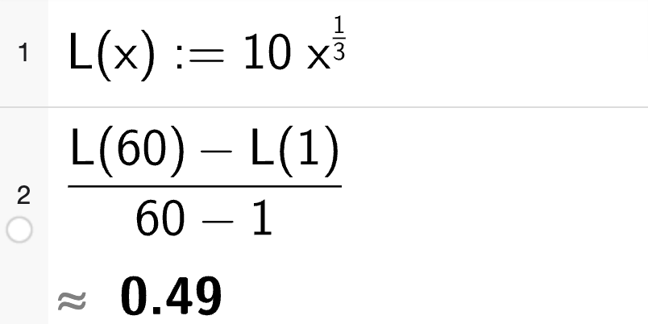

::: {.content-hidden unless-format="html"}

# Løysingsforslag 2P-Y - hausten 2024 

Her er eit forslag til løysing av hausteksamen i 2P-Y 2024.

Eg kan ikkje lova at løysinga er feilfri... 😊 

Gje meg gjerne [ein lyd](/about.qmd) om du ser feil eller lurer på noko anna.  

**Sist oppdatert:** 03.12.2024

:::

# Del 1

## Oppgåve 1

12 kr tilsvarer 30 % av opprinneleg pris. Då må 10 % vere 4 kr og 100 % vere 40 kr.

### Alternativ løysing

Bruker formelen $\text{opprinneleg pris} \cdot \text{vf} = \text{ny pris}$. Lar $x$ vere opprinneleg pris.

\begin{align*}
x \cdot 1,3 &= x + 12 \\
1,3x &= x + 12 \\
0,3x &= 12 \\
x &= 40
\end{align*}

Opprinneleg pris var 40 kr.

## Oppgåve 2

Timar arbeidd dei siste 10 dagane:
$$ 3 \quad 3 \quad 4 \quad 5 \quad 6 \quad 8 \quad 0 \quad 3 \quad 5 \quad 5 $$

### a) Gjennomsnitt og median

Gjennomsnittleg timar arbeidd per dag:
$$ \frac{3+3+4+5+6+8+0+3+5+5}{10} = \frac{42}{10} = 4,2 $$

Mediantida er den midterste verdien når tala er sorterte:

$$ 0 \quad 3 \quad 3 \quad 3 \quad 4 \quad 5 \quad 5 \quad 5 \quad 6 \quad 8 $$

Her har me eit partal observasjonar, så me må ta gjennomsnittet av dei to midterste tala. 

$$ \frac{4+5}{2} = 4,5 $$

Gjennomsnittleg timar arbeidd per dag er 4,2 og medianen er 5 timar.

### b) Kumulativ frekvens

Lagar ein frekvenstabell

| Timar | Frek. | Kum. frek. |
|:-----:|:----:|:--------:|
| 0     | 1   | 1     |
| 3     | 3   | 4     |
| 4     | 1   | 5     |
| 5     | 3   | **8**     |
| 6     | 1   | 9     |
| 8     | 1   | 10    |


Ser av tabellen at den kumulative frekvensen for 5 timar er 8. Det vil seie at Lars har arbeidd 5 timar eller mindre 8 av dei siste 10 dagane.


## Oppgåve 3

To storleikar er proporsjonale dersom ein kan skrive dei som $y = kx$ der $k$ er ein konstant. Dermed er det slik at om ein av dei to storleikane er $0$, så er den andre også $0$. Grafisk betyr det at linja må gå gjennom origo. Det er berre $f$ som går gjennom origo.

Les me av grafen til $f$ ser me at når $x=4$ er $y=100$ og når $x=8$ er $y=200$. Dette betyr at $k = \frac{100}{4} = 25$ og $y = 25x$.

**Grafen til $f$ viser samanhengen mellom to proporsjonale storleikar.**

To storleikar er omvendt proporsjonale dersom ein kan skrive dei som $y = \frac{k}{x}$ der $k$ er ein konstant. Me kan ikkje dela på $0$ så grafen kan ikkje vera definert når $x=0$. Det er berre $p$ som ikkje er definert når $x=0$.

Les me av grafen til $p$ ser me at når $x=1$ er $y=1000$ og når $x=2$ er $y=500$. Dette betyr at $k = 1000 \cdot 1 = 1000$ og $y = \frac{1000}{x}$. 

**Grafen til $p$ viser samanhengen mellom to omvendt proporsjonale storleikar.**

## Oppgåve 4

Det ser ut som figurane er sett saman av ei kvadratisk ramme med ein "arm" med lengde 2 ut frå kvart hjørne. 

Kvadratet i figur 1 har omkrets på $4=1+1+1+1=4\cdot 1$ prikkar, kvadratet i figur 2 har omkrets på $8=2+2+2+2=4\cdot 2$ prikkar og kvadratet i figur 3 har omkrets på $12=3+3+3+3 = 4 \cdot 3$ prikkar.

::: {.callout-note}
## Bytter rekkefølge

Gjer (b) før (a) for å gjera det enklare å finna figur 10...
:::


### b) Formel 

I figur $n$ vil det i følgje mønsteret skissert over vere $4n$ prikkar i omkretsen av kvadratet og $4\cdot 2=8$ prikkar i "armane".

$$F(n) = 4n + 8$$

### a) Finn talet prikkar i figur 4 og 10

Bruker formelen frå (b) til å finna antal prikkar i figur 4 og 10.

$$F(4) = 4\cdot 4 + 8 = 16 + 8 = 24$$

$$F(10) = 4\cdot 10 + 8 = 40 + 8 = 48$$

I figur 4 er det 24 prikkar og i figur 10 er det 48 prikkar.

## Oppgåve 5

Koden: 

```python
def f(x):
    return 200 * 0.975 ** x

x = 0
s = 0

while x <= 4:
    s = s + f(x)
    x = x + 1

print(s)
```

### a) Praktisk tolking av uttrykket

I linje 1-2 definerer Sara ein funksjon $f(x) = 200 \cdot 0.975^x$. 
Dette er ein eksponentiell funksjon som startar på 200 og minkar med 2,5 % for kvar einaste $x$-verdi.

$0,975$ er veksfaktor. $1-0,975=0,025$ som tilsvarar $2,5 \%$ nedgang

Funksjonen viser altså korleis utsleppet utviklar seg. Det startar med 200 tonn og minkar med 2,5 % for kvar år (`x`). 

### b) Kva vil verdien av `s` fortelje?

Verdien til `s` startar på 0. For kvar runde i løkka legg me til utsleppet for det aktuelle året, `f(x)`.

`x` startar på $0$ og aukar med $1$ for kvar runde til og med den runden der `x` er 4.

Verdien til `s` vil altså vere det totale utsleppet til bedrifta for dei 5 første åra.

# Del 2

## Oppgåve 1

Isteproduksjon i flasker kvar månad frå og med desember 2024 ($x=0$) gitt ved: 
$$F(x) = 620 \cdot 1.045^x$$

### a) Spørsmål 1 og 2 på ulike måtar

#### Grafisk

Plottar funksjonen i GeoGebra. Teikner inn linja $x=12$ for å finna produksjonen i desember 2025. Teikner inn linja $y=2000$ for å finna kva månad produksjonen er over 2000 flasker. Finn skjæringspunkta mellom $F(x)$ og dei to linjene.


Ser av punkt A at produksjonen i desember 2025 er på ca. 1050 flasker.

Ser av punkt B at produksjonen er over 2000 flasker når $x=27$. Dette vil seie at produksjonen er over 2000 flasker frå og med mars 2027.


#### Med CAS

1) Definerer funksjonen. 
2) Set inn $x=12$ for å finna produksjonen i desember
3) Løyser likninga $F(x)=2000$

{width="55%"}

Ser av CAS at produksjonen i desember 2025 er på ca. 1050 flasker og at produksjonen er over 2000 flasker frå og med mars 2027.

### b) Prosentvis auke frå des24 til des26

Vekstfaktoren pr. mnd er $1,045$. For å finna prosentvis auke frå desember 2024 til desember 2026 kan me sjå kva som skjer med vekstfaktoren i løpet av 24 månader.

1) Reknar ut ny vekstfaktor
2) Finn ut kva prosent det tilsvarar. 

{width="55%"}

Auken frå desember 2024 til desember 2026 er omlag 187,6 %.


## Oppgåve 2

### a) Bakteriar på svampen

:::: {.columns}
::: {.column width=60%}

Mellom 25 og 54 milliardar bakteriar per $cm^3$ og omlag $150 cm^3$ kjøkkensvamp.

**Det vil vera mellom $3.75\cdot 10^{12}$ og $8.1\cdot 10^{12}$ bakteriar på kjøkkensvampen.**
:::

::: {.column width=40%}

:::

::::

### b) Meter?

:::: {.columns}
::: {.column width=60%}

Brukar gjennomsnittet av grensene for både lengde og tal bakteriar som estimat. 

1 mikrometer er ein tusandedels millimeter. Ein millimeter er ein tusandedels meter. Dermed er 1 mikrometer ein milliondels meter $10^{-6}$.

**Bakteriane vil strekka seg omlag $6.5\cdot 10^{6}$ meter.**

:::

::: {.column width=40%}

:::

::::


## Oppgåve 3

\begin{align*}
\text{10\% av 50} &= 0,1 \cdot 50 &&=\frac{1}{100} \cdot 10 \cdot 50 \\
\text{50\% av 10} &= 0,5 \cdot 10 &&=\frac{1}{100} \cdot 50 \cdot 10 \\
\end{align*}

Tilsvarande gjeld for dei to andre oppgåvepara. Generelt: 

\begin{align*}
\text{a\% av b} &= \frac{a}{100} \cdot b \\
\text{b\% av a} &= \frac{b}{100} \cdot a \\
\end{align*}

Oppgåvepara vil dermed alltid ha same svar om dei føl dette oppsettet.

## Oppgåve 4

### a) Modellar

Lar $x$ vere antal dagar. 

**Modell A** 0 kr fastpris og 50 kr pr dag.
$$A(x) = 50x$$

**Modell B** 1995 kr fastpris og 30 kr pr dag.
$$B(x) = 1995 + 30x$$
 
**Modell C** 3490 kr fastpris og 24 kr pr dag.
$$C(x) = 3490 + 24x$$

### b) Kva tid løner avtale B seg?

Plottar alle tre modellane i GeoGebra og ser kva tid $B$ vert billigare enn $A$ og $C$.


Ser av skjæringspunkta $D$ og $E$ at avtale B er den billigaste frå og med dag 100 til og med dag 249. 


## Oppgåve 5

::: {.callout-tip}
## Statistikk i CAS :rocket:

:clapper: [Her](https://youtu.be/08HBy3evwt4?si=QIaXXWE9TzyL6wqu) er eit par tips til statistikkoppgåver i CAS.  
:::

### a) Median, gjennomsnitt og standardavvik på lag A

Bruker CAS. Vel populasjonsstandardavvik (`stavvp`) sidan det er seks personar på laget og me har data på alle seks. 

{width="45%"}


### b) B og C vs A

**Lag B:** 

- høgare medianalder og gjennomsnittsalder enn A. 
- lågare standardavvik enn A.

At standardavviket er lågare, betyr at det er mindre spreiing i alderen på personane på lag B enn på lag A. At snitt- og medianalder er høgare, betyr at det er fleire eldre personar på lag B enn på lag A.

**Lag C:**

- Lågare medianalder enn A
- Høgare gjennomsnitt og standardavvik enn A

At standardavviket er høgare, betyr at det er meir spreiing i alderen på personane på lag C enn på lag A. At det både er høgare snittalder og lågare medianalder tyder på at det er fleire yngre personar på lag C, men at dei som er eldst på lag C er eldre enn dei som er eldst på lag A.


### c) Mogleg aldersfordeling på B og C

Forslag til aldersfordelingar på lag B og C som svarar til opplysningane i oppgåva:

:::: {.columns}

::: {.column width="50%"}

:::

::: {.column width="50%"}

:::

::::


## Oppgåve 6

### a) bestemme a og b

Ser av tabellen at $L(1) = a \cdot 1^b = 10$ som vil seie at $a = 10$.

Bruker CAS for å rekna ut $b$:

{width="45%"}

Ser av CAS at $b = \frac{1}{3}$.

**Tala er $a=10$ og $b=1/3$.**

### b) 45 min samanhengande

Bruker CAS

{width="45%"}

**Det vil ta omlag 13 veker før ho klarar å springa 45 minutt samanhengande.**

### c) Gjennomsnittleg auke frå dag 1 til 60

Bruker CAS. Finn gjennomsnittleg auke. Deler endring i tid med endring i dagar.

{width="45%"}

**Gjennomsnittleg auke per dag frå dag 1 til 60 er omlag 0,5 min.**


## Oppgåve 7

Lagar litt grafar og utrekningar ut frå datamaterialet. 

Startar med eit stolpediagram for å få ei oversikt over datamaterialet. 


Ser av stolpediagrammet at det er ein del endringar i tidsbruken til både kbinner og menn i perioden. Lagar eit nytt diagram der eg prøver å få fram endringane frå 1970 til 2010. 


Her ser me enno tydelegare dei store endringane som har skjedd. Kvinner bruker mykje mindre tid på hushaldsarbeid i 2010 enn i 1970, medan menn bruker meir tid på det same. Samstundes ser me at kvinner bruker mykje meir tid på inntektsgivande arbeid i 2010 enn i 1970, medan menn bruker mindre tid på det same. Begge kjønn bruker noko meir tid på utdanning. 

Gjer nokre utrekningar for å seie meir om endringa. 


::: {.callout-note collapse="true"}
## Formlar i Excel


:::

Her ser me at menn bruker 35,1 % meir tid på hushaldsarbeid i 2010 enn i 1970 medan kvinner bruker 35,3 % mindre tid. Endringane i utdanning som såg små ut på det første stolpediagrammet ser me no er meir omfattande enn det såg ut som. Kvinner bruker nær 68 % meir tid på utdanning og menn rundt 18,5 %. I snitt har kvinner auka tida brukt på utdanning med rundt 1,3 % årleg frå 1970 til 2010. I tillegg til 1,1 % årleg auke i tid brukt på inntektsgivande arbeid. 

::: {.callout-tip}
## Andre utrekningar

Dette er ei ganske open oppgåve, og ein kan rekna på mange ulike ting. Ein kan til dømes sjå på kor stor del av si vakne tid menn og kvinner bruker på dei ulike aktivitetane osb. Sidan oppgåva gjev 4 poeng seier eg meg nøgd med dette... 😊
:::


## Oppgåve 8

Vel å løysa med Python:

### a)

Startverdi er 40 km. 

Vekstfaktor til 5% auke er $1,05$.

Skriv eit program for å finne ut kor langt han syklar. I veke 50 vil lengda ha auka 49 gongar: 
```{python}
veke = 1
km = 40
vf = 1.05

for i in range(49):
    km = km * vf
    veke = veke + 1

print("I veke 50 vil han sykla", round(km,2), "km")
```

### b)

Vil finna ut kor mykje han har sykla samanlagt etter 50 veker. Endrar litt på programmet:

```{python}
veke = 1
km = 40
vf = 1.05
total_km = 40

for i in range(49):
    km = km * vf
    total_km = total_km + km
    veke = veke + 1
    
print("Etter 50 veker har han sykla", round(total_km,2), "km")
```