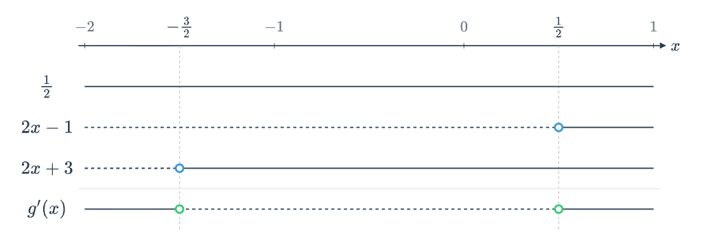

::: {.content-hidden unless-format="html"}

# Løysingsforslag S1 - våren 2025

Her er eit forslag til løysing av våreksamen i S1 2025. I del 2 er oppgåvene stort sett Python brukt som hjelpemiddel.

Eg kan ikkje lova at løysinga er feilfri... 😊 Gje meg gjerne ein lyd i kommentarfeltet eller [her](/about.qmd) om du ser feil :mag: 

Sist oppdatert: 29.08.2025

---

Eksamenssettet finn du hos UDIR: [Finn eksamensoppgaver](https://sokeresultat.udir.no/eksamensoppgaver.html)

I menyen til høgre kan finn du løysingsforslaget som pdf.

:::

# Del 1 - utan hjelpemiddel

## Oppgåve 1

Deriver funksjonen

$$ \begin{align*} 
f(x) &= e^{-2x} + \frac{1}{5} x^5 - 2\pi \\ \ \\
f'(x) &= -2 e^{-2x} + x^4
\end{align*}$$

(kjerneregel, polynomderivasjon og konstantregel)

## Oppgåve 2

Funksjonen $g$ gitt ved
$$ g(x) = \frac{1}{2}e^x \cdot (2x-1)^2 $$

### a) nullpunkt

Set $g(x)=0$ og løyser. Veit at $e^x \neq 0$ for alle $x\in \mathbb{R}$. Dermed må 

$$ \begin{align*}
(2x-1)^2 &= 0 \\
2x-1 &= 0 \\
2x &= 1 \\
x &= \frac{1}{2}
\end{align*}$$ 

### b) den deriverte

Lar $u=e^x \Rightarrow u'=e^x$ og $v=(2x-1)^2 \Rightarrow v'=2(2x-1)\cdot 2 = 4(2x-1)$. 

Dermed blir

$$ \begin{align*}
g'(x) &= \frac{1}{2} (uv)' \\
&= \frac{1}{2} (u'\cdot v + u\cdot v' ) \\
&= \frac{1}{2} \left(e^x \cdot (2x-1)^2 + e^x\cdot 4(2x-1)\right) \\
&= \frac{1}{2} e^x(2x-1)\left((2x-1) + 4\right) \\
&= \frac{1}{2} e^x(2x-1)(2x+3) \\
\end{align*}$$ 

som skulle visast.

### c) Topp og botnpunkt

Sjekkar når $g'(x)=0$. Igjen er $e^x \neq 0$ for alle $x\in \mathbb{R}$. 

$$ \begin{align*}
g'(x) &= 0 \\
\frac{1}{2} e^x(2x-1)(2x+3) &= 0 \\
2x-1=0 \quad &\vee \quad 2x+3=0 1 \\
x = \frac{1}{2} \quad &\vee \quad x = - \frac{3}{2}
\end{align*}$$ 

Teiknar forteiknslinje:



Ser at $g$ har toppunkt i $x=-\frac{3}{2}$ og botnpunkt i $x=\frac{1}{2}$. 

Set inn verdiane i $g(x)$ for å finna y-koordinatane til dei to punkta

**Toppunkt** <br>
$$ \begin{align*}
g\left(-\frac{3}{2}\right) &= \frac{1}{2}e^{-\frac{3}{2}} \cdot \left(2\left(-\frac{3}{2}\right)-1\right)^2 \\
&= \frac{1}{2}e^{-\frac{3}{2}} (-4)^2 \\
&= 8e^{-\frac{3}{2}} \\
\end{align*}$$ 

Toppunkt i $\left(-\frac{3}{2}, 8e^{-\frac{3}{2}}\right)$

**Botnpunkt** <br>
$$ \begin{align*}
g\left(\frac{1}{2}\right) &= \frac{1}{2}e^{\frac{1}{2}} \cdot \left(2\left(\frac{1}{2}\right)-1\right)^2 \\
&= \frac{1}{2}e^{\frac{1}{2}} (0)^2 \\
&= 0\\
\end{align*}$$ 

Botnpunkt i $\left(\frac{1}{2}, 0\right)$

::: {.content-hidden when-format="html"}
```{typst}
#pagebreak()
```
:::

## Oppgåve 3

Løys likningane

### a) eksponentiallikning

$$ \begin{align*}
3^{3x+2}-5 &= 76 \\
3^{3x+2} &= 81 = 9^2=3^4 \\
3x+2 &= 4 \\
x &= \frac{2}{3}
\end{align*}$$ 

### b) logaritmelikning

$$ \begin{align*}
3\lg(x)+2\lg(x^2) + \lg\left(\frac{1}{x^9}\right)&=2 \\
3\lg(x)+4\lg(x) + \lg(x^{-9})&=2 \\
3\lg(x)+4\lg(x) -9 \lg(x)&=2 \\
-2 \lg(x) &= 2 \\
\lg(x) &= -1 \\
x &= 10^{-1} = 0,1
\end{align*}$$ 

## Oppgåve 4 

Bestem grenseverdiane

### a) 

Ser at om me set inn $0$ vil me få $0$ i nemnar, men ikkje i teljar. Dvs. me er ikkje i ein situasjon der både teljar og nemnar går mot 0 samstundes. Ser på dei einsidige grenseverdiane. 

I begge dei to tilfella vil $3(x^2-3) \to 18$ når $x \to 3$

Når $x \to 3^-$ vil nemnaren vera negativ. Dermed går brøken mot $-\infty$. 

Når $x \to 3^+$ vil nemnaren vera positiv. Dermed går brøken mot $\infty$. 

Dei einsidige grenseverdiane eksisterer ikkje, heller ikkje grenseverdien til uttrykket. 


### b)

$$\begin{align*}
\lim_{x \to 4} \frac{\sqrt{x}-2}{x-4} &= \lim_{x \to 4} \frac{\sqrt{x}-2}{(\sqrt{x}-2)(\sqrt{x}+2)} \\
&= \lim_{x \to 4} \frac{1}{\sqrt{x}+2} \\
&= \frac{1}{\sqrt{4}+2} \\
&= \frac{1}{2+2} \\
&= \frac{1}{4}
\end{align*}
$$

## Oppgåve 5

Arne skyt tre skot. Treff på 80% av skota sine. Antek skota er uavhengige av kvarandre. 

Me let $X$ vera talet skot Arne treff på. Me kan gå ut frå at $X$ er binomisk fordelt sidan

- Skota (delforsøka) er uavhengige av kvarandre
- Kvart skot har to mogleikar (treff eller ikkje treff). 
- Sannsynet for å treffa er likt i alle delforsøka, $p=0.8$.

### a) Dei to første skota

Treff og treff: $0.8 \cdot 0.8 = 0.64$

Det er 64% sannsyn for at Arne treff på begge dei to første skota.

### b) Nøyaktig to av tre skot

Bruker formelen for binomisk sannsyn:

$$ P(X=k) = \binom{n}{k} p^k (1-p)^{n-k} $$

Der $n$ er totalt antal skot, $k$ er antal treff, og $p$ er sannsynet for treff.

Her er $n=3$, $k=2$ og $p=0.8$.

$$ \begin{align*}
P(X=2) &= \binom{3}{2} (0.8)^2 (0.2)^{3-2} \\
&= 3 \cdot 0.64 \cdot 0.2 \\
&= 3 \cdot 0.128 \\
&= 0.384
\end{align*} $$

Det er 38.4% sannsyn for at Arne treff på nøyaktig to av dei tre skota.

### c) Høgst eitt av tre skot

Me har sannsynet for nøyaktig to treff frå oppgåve b). Sannsynet for at han treff på alle tre skota er $0.8^3 = 0.512$.

Dermed er sannsynet for at han treff på minst to skot $0.384 + 0.512 = 0.896$.

Sannsynet for at han treff på høgst eitt skot er dermed $1 - 0.896 = 0.104$.

Det er 10.4% sannsyn for at Arne treff på høgst eitt av dei tre skota.

## Oppgåve 6

Funksjonane $f$ og $g$ er gitt ved

$$ f(x) = \begin{cases}
x^2 + 2, & x < 0 \\
2e^x, & x \geq 0
\end{cases} $$

og

$$ g(x) = \begin{cases}
x^2 + 2, & x < 0 \\
1, & x = 0 \\
2e^x, & x > 0
\end{cases} $$

### a) f i x = 0

Skal sjekka om $f$ er kontinuerleg i $x=0$. For at ein funksjon skal vera kontinuerleg i eit punkt, må 

$$ \lim_{x \to a^-} f(x) = \lim_{x \to a^+} f(x) = f(a) $$

Ser på dei einsidige grenseverdiane. 

$$ \begin{align*}
\lim_{x \to 0^-} f(x) &= \lim_{x \to 0^-} (x^2 + 2) = 0^2 + 2 = 2 \\
\lim_{x \to 0^+} f(x) &= \lim_{x \to 0^+} 2e^x = 2e^0 = 2 \\
\end{align*} $$

Sidan dei einsidige grenseverdiane er like, og $f(0) = 2$, er $f$ kontinuerleg i $x=0$.

### b) g i x = 0

Ser at dei einsidige grenseverdiane er dei same som for $f$ i oppgåve a). Her er i tillegg $g(0) = 1$. Dermed er ikkje $g$ kontinuerleg i $x=0$.

# Del 2 - med hjelpemiddel

## Oppgåve 1

Kodelås med tre tal. 7, 8, 9 og 0 er ikkje med. 

### a) Gjette på første forsøk

```{python}
# Ulike kombinasjonar
komb = 6**3

# Sannsyn for å gjette rett på første forsøk
sannsyn = 1/komb

# Skriv ut resultatet
print(f"P(første forsøk) = {sannsyn:.4f}")
```

### b) Simulering - første forsøk

Lagar eit program som simulerer 10 000 forsøk på å knekka kodelåsen og tel opp kor mange gonger ein gjett rett på første forsøk.

```{python}
# Set opp sannsynsgenerator
import numpy as np
rng = np.random.default_rng()

# Antal forsøk
N = 100000

# Rett kode
rett_kode = [1, 2, 3]

# Teljar for kor mange gonger me gjett rett på første forsøk
første_forsøk = 0

for forsok in range(N):
    # Generer ein tilfeldig kode
    gjetta_kode = rng.integers(1, 7, size=3).tolist()
    
    # Sjekk om den gjettede koden er lik den riktige koden
    if gjetta_kode == rett_kode:
        første_forsøk += 1

# Sannsyn for å gjette rett på første forsøk
sannsyn = første_forsøk / N

# Skriv ut resultatet
print(f"P(første forsøk) = {sannsyn:.4f}")
```

## Oppgåve 2

Funksjon $f$ med delt forskrift. Ser ikkje heile funksjonsuttrykket. 

$$ f(x) = \begin{cases}
-9x - 15, & x < -2 \\
???, & -2 \leq x \leq 1 \\
\frac{x^2}{2} - x - \frac{7}{2}, & x > 1
\end{cases} $$

Veit at 

- $f$ er kontinuerleg for alle $x \in \mathbb{R}$
- midterste uttrykk er eit tredjegradspolynom
- $f'(-2) = -9$ og $f'(1)=0$

Det midterste uttrykket må vera eit tredjegradspolynom, dvs. av typen
$$ ax^3 + bx^2 + cx + d $$

Veit at $f$ er kontinuerleg i $x=-2$ og $x=1$. Dermed må
$$ \begin{align*}
\lim_{x \to -2^-} f(x) &= \lim_{x \to -2^+} \\
(-9(-2) - 15) &= a(-2)^3 + b(-2)^2 + c(-2) + d \\
3 &= -8a + 4b - 2c + d
\end{align*} $$

og 

$$ \begin{align*}
\lim_{x \to 1^-} f(x) &= \lim_{x \to 1^+} f(x) \\
a(1)^3 + b(1)^2 + c(1) + d &= \frac{1^2}{2} - 1 - \frac{7}{2} = -4 \\
a + b + c + d &= -4
\end{align*} $$

I tillegg veit me at $f'(-2) = -9$ og $f'(1)=0$. Deriverer det midterste uttrykket:

$$ f'(x) = 3ax^2 + 2bx + c $$

Dermed må 
$$ \begin{align*}
f'(-2) &= -9 \\
3a(-2)^2 + 2b(-2) + c &= -9 \
12a - 4b + c &= -9
\end{align*} $$

og

$$ \begin{align*}
f'(1) &= 0 \\
3a(1)^2 + 2b(1) + c &= 0 \\
3a + 2b + c &= 0
\end{align*} $$

Løyser likningssettet i CAS:

```{python}
# Importerer bibliotek
from sympy import symbols, Eq, solve

# Definerer symbolene a, b, c, d
a, b, c, d = symbols('a b c d')

# Definerer likningane
eq1 = Eq(-8*a + 4*b - 2*c + d, 3)  # Kontinuitet i x = -2
eq2 = Eq(a + b + c + d, -4)         # Kontinuitet i x = 1
eq3 = Eq(12*a - 4*b + c, -9)        # f'(-2) = -9
eq4 = Eq(3*a + 2*b + c, 0)          # f'(1) = 0

# Løyser likningssettet
solution = solve((eq1, eq2, eq3, eq4), (a, b, c, d))

# Skriv ut løysinga
print("Løsning for a, b, c, d:")
print(solution)
```

Funksjonsuttrykket i det midterste intervallet er dermed
$$ -\frac{13}{27}x^3 + \frac{7}{9}x^2 - \frac{1}{9}x - \frac{113}{27}$$

## Oppgåve 3

Ti lappar med elevnamn. Trekk fire lappar med namn som skal vera med i ei gruppe.

### a) Moglege samansettingar

Trekk fire elevar (utan tilbakelegging) frå ei gruppe på ti. Dette er ein kombinasjon, dvs. rekkjefølgja på elevane spelar ingen rolle.

```{python}
from scipy.special import comb

n = 10  # Totalt antal elevar
k = 4   # Antal elevar som skal trekkast

kombinasjoner = comb(n, k, exact=True)
print(f"Antal moglege samansettingar: {kombinasjoner}")
```

### b) Minst to gutar

Sju av ti er jenter. Skal finna sannsynet for at gruppa har minst to gutar.

Dette kan me sjå på som eit hypergeometrisk forsøk. Me har totalt $N=10$ elevar, der $K=3$ er gutar og $N-K=7$ er jenter. Me trekk $n=4$ elevar utan tilbakelegging og vil finna sannsynet for at $k \geq 2$ av dei er gutar.

Løyser ved simulering.

```{python}
import numpy as np
rng = np.random.default_rng()

gutar = 3
jenter = 7
gruppe = 4

#tal simuleringar
N = 1000000 

trekte_gutar = rng.hypergeometric(gutar, jenter, gruppe, size=N)

minst_to_gutar = np.sum(trekte_gutar >= 2)
sannsyn = minst_to_gutar / N
print(f"Sannsyn for minst to gutar: {sannsyn:.4f}")
```

### c) 


