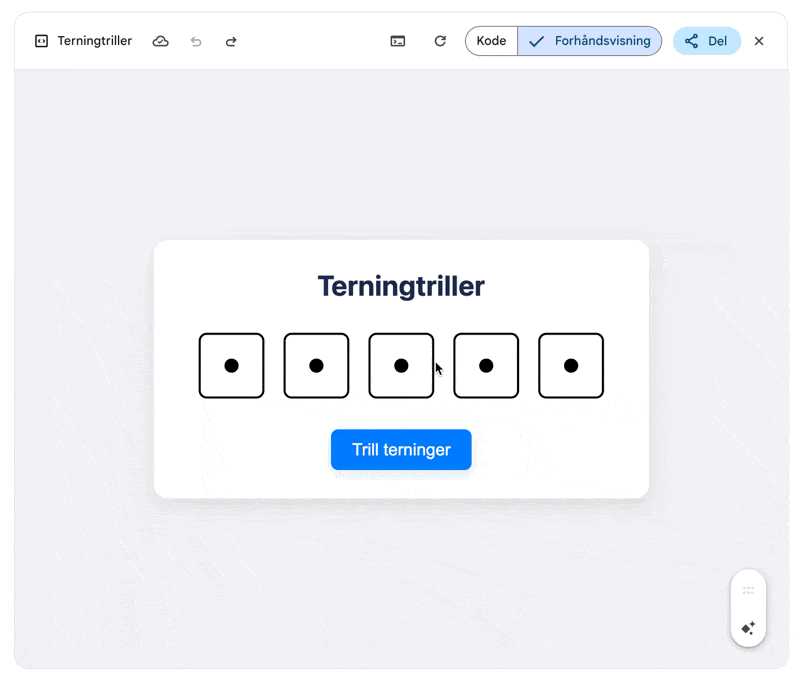
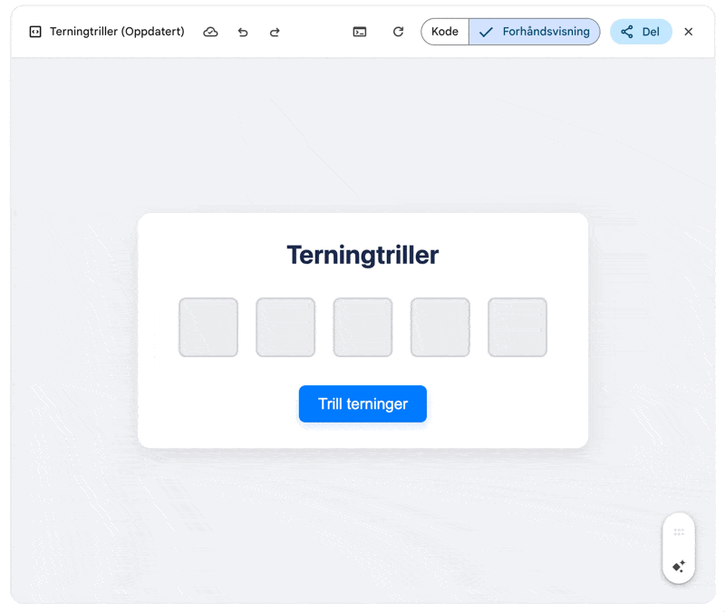
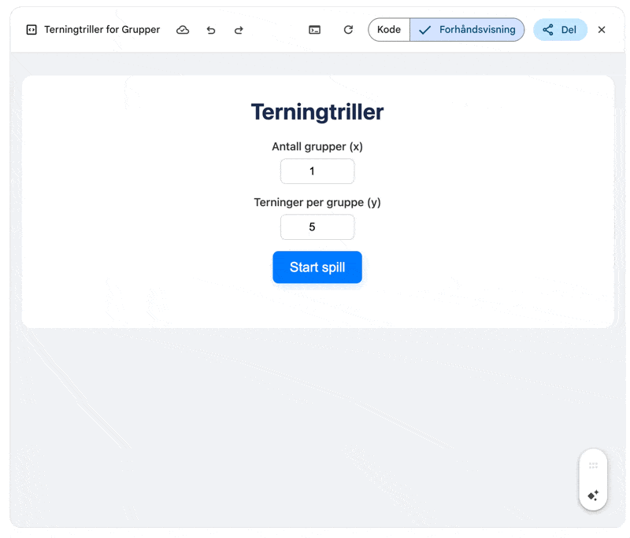
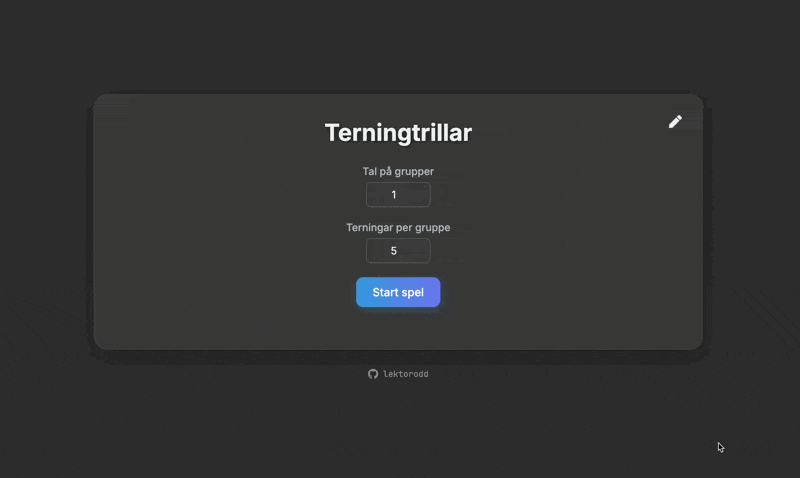
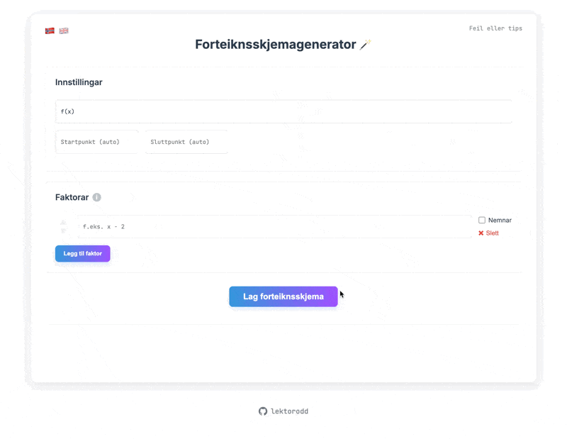
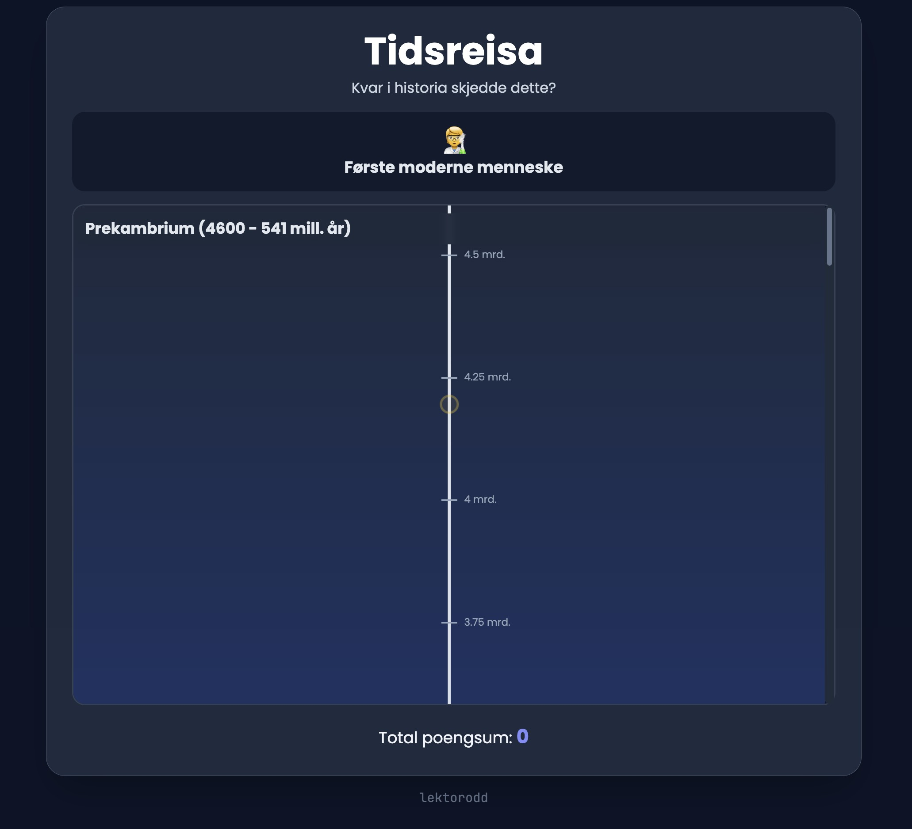

::: {.callout-tip}
## tl;dr

Lag appar, det er gøy

- [`lektorodd.no/terning.html`](https://lektorodd.no/terning.html)
- [`lektorodd.no/grupper.html`](https://lektorodd.no/grupper.html) 
- [`lektorodd.no/forteiknslinjer.html`](https://lektorodd.no/forteiknslinjer.html)
- [`lektorodd.no/brok.html`](https://lektorodd.no/brok.html)
- [`lektorodd.no/geotid.html`](https://lektorodd.no/geotid.html)

:::

Etter at KS lanserte eit prosjekt om [nasjonal personvernskonsekvensvurdering](https://www.ks.no/fagomrader/digitalisering/skolesec/nasjonal-dpia-for-google/ny-nasjonal-personvernkonsekvensvurdering-for-bruk-av-google-workspace-for-education-i-skolen/) (puh) for Google Workspace for Education, har nok etter kvart fleire fått inn Google Gemini og Google NotebookLM i lista over godkjente verktøy.

I Vestland fylkeskommune har me fått på plass begge desse verktøya i skulane, både for tilsette og elevar. I dette innlegget skal eg visa kort kva mogleikar som ligg i eitt av verktøya i Google Gemini, Canvas. 

Canvas er ein type grensesnitt der du i dialog med prateboten kan laga og utvikla innhald (ulike dokument og appar). Andre aktørar har tilsvarande (t.d. `artefakt` i Claude og `canvas` (!) i ChatGPT). Gjennom dialogen vil dokumentet eller appen bli oppdatert og endra. Lagar du appar i Canvas kan du og testa desse direkte i grensesnittet etter kvart som du utviklar dei. 

## Første test: terningtrillar

For å testa verktøyet full fart laga eg ein terningtrillar til ein oppstarsaktivitet. Det er aldri lett å finna nok terningar på kort tid, og eg hadde bruk for ganske mange av dei. 20 min før timen starta (viktig å vera ute i god tid...) bad eg Google Gemini om å laga ein terningtrillar for meg.

> ```Lag en enkel html app (en fil) for å trille 5 terninger og vise resultatet (med bilde av terningsiden som ble trillet). Terningene skal vises horisontalt etter hverandre. Inkluder en trille-knapp og en kort animasjon når terningene "trilles"```

Dette resulterte i ein heilt enkel app. Det var med vilje, sidan det fort kan oppstå utfordringar om ein legg til for mykje kompleksitet. 

{width="75%"}

Vidare bad eg om litt betre grensesnitt. Kan tola mykje, men ikkje at terningane viser 1 før og under trilling... Resultatet vart straks betre. 

{width="75%"}

Så rosina i pølsa og målet med appen. Trilling av eit gitt tal terningar for eit gitt tal grupper. Eg spurte fint:

> ```Perfekt! Nå vil jeg utvide appen. Jeg skal trille terninger for x grupper. De x gruppene skal trille y terninger (felles y for alle x, men ternignene skal trilles separat). Jeg vil at du spør først hvor mange grupper det er (x) og hvor mange terninger som skal trilles for hver gruppe (y). De ulike gruppene sine terninger skal vises som nå, men stables under hverandre. Det må komme tydelig frem hvile rader med terninger som hører til hvilke grupper. Start gjerne med gruppe 1 øverst. Viss det er bare 1 gruppe kan appen fungere som den gjør nå.```

Og ting starta å bli ganske bra: 

{width="75%"}

Tre prompt og app klar for klasserommet. Etter dette gjorde eg ein del testing og tilpassing for å få appen til å bli litt betre:

- Oppdatert grensesnitt/stil
- Tilpasse til storskjerm, mange grupper og terningar. 
- Fleire språk
- Tømmeknapp og omstartknapp

Til slutt endte eg opp med [eit produkt](https://lektorodd.no/terning.html) som nesten kunne vore kommersielt... På kort tid, og utan å nytta programmeringskompetansen min i nokon grad. Dette kan altså alle få til.

{width="75%"}

::: {.callout-tip}
## Tips

Dersom du er interessert i ein terning-aktivitet for å få hjernen i gang kan du sjå [her](https://github.com/lektorodd/terningtrillar).

:::

## Andre test: gruppetrekkar

Eg er stor fan av tilfeldige grupper og hyppig skifte av plassar i klasserommet. For å laga nye klassekart til kvar veke har eg brukt eit python-skript for å tildela elevane bordnummer (eller gruppenummer ved behov). Dette funkar greitt, men det er litt tungvint å opne og køyre skriptet. Ein enkel app hadde vore betre. 

**MEN** elevane må inn i appen. Det kan vera tungvint. Lister med namn må lagast, systema genererer upassande tabellar osv. Styr. Den andre appen eg endte opp med er då ein app med to bruksområde.

1) Gjere om ekle klasselister frå Visma InSchool (eit skrekkens produkt) til ein meir nyttig og oversiktleg form. 
2) Dele inn klassar i tilfeldige grupper. 

### 1) klasselister

Appen kan ta inn heile tabellen frå pdf-liste generert i VIS. Så kan du velge om du skal ha fornamn, etternamn og klasse med i lista. Er det fleire elevar med same fornamn legg han automatisk til initialar. Du kan endre rekkefølgen på kolonner og raskt kopiere lista. (For eksempel inn i kollega [Rudi sin klassekartgenerator](https://rudiend.github.io/klassekartgenerator/)). 

### 2) grupper

Her kan du dele inn elevane i tilfeldige grupper. Etter å ha kopiert inn tabellen frå klasselista kan du fjerne dei som evt ikkje er i timen før du deler inn i gitt tal grupper. Perfekt. Last ned fila og køyr lokalt, ingen datalagring, ingen personvernsproblem.

Prøv gruppeverktøyet her (med demo-namn lagt inn): [`lektorodd.no/grupper.html`](https://lektorodd.no/grupper.html)

## Tredje test: forteiknslinjegenerator

Å lage forteiknslinjer og forteiknsskjema i matematikken er nyttig matematisk. Det er lett å gjera for hand. Men digitalt, t.d. i eit løysingsforslag er det litt verre. Å laga ein app for dette har vist seg krevjande for praterobotar. Eg har prøvd å laga det gjennom allslags verktøy utan at dei heilt har fått det til. Men Gemini 2.5 Pro gjekk det til slutt. Me har vore i lange diskusjonar kring både det eine og det andre aspektet i utviklinga. 

Appen er ikkje 100%, men langt oppe på nittitalet. Modellen låser seg ofte til sine løysingar og tankar, så i eit så komplisert prosjekt har det hjulpe med kompetanse i både programmering, LaTeX og matematikk. Stort sett positiv tone i samtalen... 

> MEG: ```Det går framleis ikkje. La oss snakka om korleis me kan få det til. Kan det vera ein tanke å ikkje bruka numeriske (...)```

> GEMINI: ```Ja, det er ein glimrande idé og ein veldig smart måte å løyse problemet på.Du har heilt rett i kva som er gale. Problemet er (...)```

Du kan prøva appen på [`lektorodd.no/forteiknslinjer.html`](https://lektorodd.no/forteiknslinjer.html).

{width="75%"}

## Andre testar: spelbasert læring

Verktøyet her kan brukast til mykje. Det er stort sett fantasien (som vanleg) som er avgrensande faktor. Har laga to ulike spel for å testa korleis det kan gå. Eit brøkspel og eit tidslinjespel. [Brøkspelet](https://lektorodd.no/brok.html) er raska saman i full fart, men tidslinjespelet er litt meir raffinert og testa. 

I geofag er tidsomgrepet og forståing av tid sentralt. Eg plar illustrere forhold mellom lang og kort tid med ei 20 m lang tidslinje der mennesket ikkje er til stades på dei første 19,999 metrane, og "kjempegamle" ting på 70 000 000 år ligg på 19,65 meter... (0 meter tilsvarar 4 mrd år sidan). 

For å gjera dette på ein annan måte har eg prøvd å laga eit spel. Inspirert av GeoGuessr der du gjettar geografisk plassering (og får poeng etter avstand i luftlinje) vil du her gjetta plassering på tidslinja og få poeng etter avstand. 9 ting/fenomen i tilfeldig rekkefølge, og du må plassere dei på tidslinja. Til slutt får du ei oppsummering av gjett og fasit sortert etter kor nær du var. 

Prøv gjerne geotid her: [`lektorodd.no/geotid.html`](https://lektorodd.no/geotid.html)

{width="75%"}

## Utfordringar

Det kan vera litt utfordrande å dela appane på ein god måte. Ein kan dela html-filene med dei, be dei lasta dei ned og opna dei i nettlesar. Det er nok for mange det lettaste. Litt meir behageleg å gjera dei tilgjengeleg på nett (enten på eit domene eller gjennom Github) men det blir fort styr for mange. Det dukkar nok opp nokre løysingar etterkvart. 